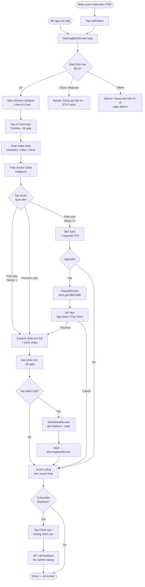
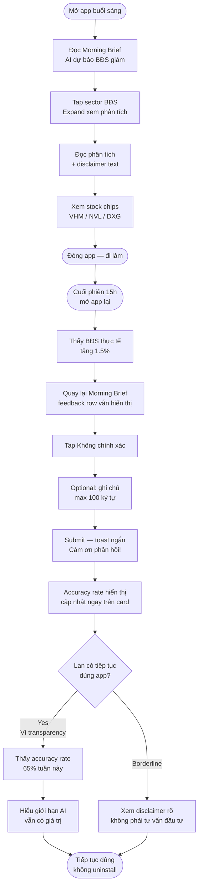
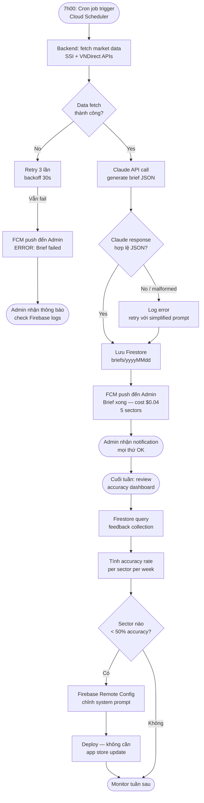

# UX Design Specification FTrade

**Author:** Chau
**Date:** 2026-03-31

---

<!-- UX design content will be appended sequentially through collaborative workflow steps -->

## Executive Summary

### Tầm nhìn sản phẩm

FTrade là app phân tích chứng khoán Việt Nam tích hợp AI, nhắm đến NĐT cá nhân mới. Phase 3 UX tập trung vào AI Morning Brief — biến dữ liệu thị trường thành insight hành động bằng tiếng Việt dễ hiểu trong 2 phút mỗi sáng. Tagline UX: "Mở app, hiểu thị trường, tự tin ra quyết định."

### Người dùng mục tiêu

**Primary: NĐT mới (1-3 năm)**
- 25-35 tuổi, nhân viên văn phòng, đầu tư part-time
- Dùng smartphone chủ yếu (iOS/Android), đọc tin buổi sáng trước 9h
- Pain point: quá tải dữ liệu từ 3-5 app, thiếu context để ra quyết định
- Mong muốn: "Ai đó tóm tắt giúp tôi hôm nay cần chú ý gì"

**Secondary: Admin (Founder)**
- Monitor accuracy, cost, system prompt
- Dùng Firebase Console, không cần UI riêng cho MVP

### Thách thức thiết kế chính

1. Morning Brief phải scannable trong 2 phút — hierarchy rõ, không wall of text
2. Free/Premium gating tạo giá trị trước khi lock — "try before buy" UX
3. Disclaimer pháp lý bắt buộc nhưng không phá trải nghiệm đọc
4. Offline experience rõ ràng — phân biệt data cũ vs mới

### Cơ hội thiết kế

1. Tạo thói quen daily — Morning Brief = lý do mở app mỗi sáng
2. Flow liền mạch brief → sector → stock detail (leverage Phase 1-2 screens)
3. Feedback 1-tap tăng engagement và cải thiện AI quality

## Core User Experience

### Trải nghiệm cốt lõi

**Core Action:** Đọc Morning Brief mỗi sáng trước 9h.
User mở app → scan summary → tap sector quan tâm → xem mã đáng chú ý → tap vào mã → xem StockDetail. Toàn bộ flow < 2 phút.

**Core Loop hàng ngày:**
1. 7h30: Nhận push notification "Bản tin sáng đã sẵn sàng"
2. 7h45: Mở app → đọc summary (30 giây)
3. Tap sector quan tâm → xem phân tích + mã (60 giây)
4. Tap mã → StockDetail → quyết định có theo dõi không (30 giây)
5. Cuối phiên: đánh giá "Chính xác / Không chính xác" (5 giây)

### Chiến lược nền tảng

- **Mobile-first:** Flutter cross-platform (iOS 14+ / Android 8.0+)
- **Touch-optimized:** Tap to expand sector cards, swipe between sections
- **Offline-ready:** Cache brief cuối cùng, banner rõ ràng khi offline
- **Performance:** Brief screen load < 2 giây, app cold start < 4 giây
- **Existing screens:** Leverage StockDetail, News, Watchlist từ Phase 1-2

### Tương tác không cần suy nghĩ

1. **Mở app = thấy brief ngay** — không cần navigate, Morning Brief là landing screen hoặc tab nổi bật
2. **Tap sector = expand chi tiết** — accordion/card pattern, không chuyển screen
3. **Tap mã = đến StockDetail** — flow liền mạch, back button quay lại brief
4. **Feedback 1-tap** — "Chính xác ✓" / "Không chính xác ✗" ngay dưới mỗi sector
5. **Offline tự động** — không cần user làm gì, cache background, hiển thị data cũ khi mất mạng

### Khoảnh khắc quyết định thành bại

1. **"Aha moment":** Đọc brief sáng → cuối phiên thấy dự báo đúng → "App này nghĩ hộ mình thật" (Journey 1 - Minh)
2. **First-time success:** Lần đầu mở app → thấy brief tóm tắt rõ ràng → không cần mở CafeF/SSI nữa
3. **Upgrade trigger:** Free user thấy 1 nhóm ngành hay → muốn xem thêm nhưng bị lock → upgrade
4. **Trust builder:** Brief sai → user feedback → thấy accuracy rate minh bạch → vẫn tin tưởng app

### Nguyên tắc trải nghiệm

1. **"2 phút hoặc ít hơn"** — Mọi thông tin quan trọng phải accessible trong 2 phút đầu
2. **"Hiển thị, không giải thích"** — Dùng visual hierarchy, màu sắc, icon thay vì text dài
3. **"Giá trị trước, paywall sau"** — Free user phải thấy đủ giá trị 1 sector trước khi bị prompt upgrade
4. **"Tin cậy qua minh bạch"** — Luôn có disclaimer, timestamp, accuracy rate — không giấu giới hạn
5. **"Không có dead end"** — Mọi element đều tappable, mọi screen đều có action tiếp theo

## Desired Emotional Response

### Mục tiêu cảm xúc chính

**Primary:** "Tự tin & được hỗ trợ" — User cảm thấy có "cố vấn thông minh" bên cạnh, không phải tự mò mẫm một mình nữa.

**Secondary:**
- **Hiệu quả:** "2 phút là xong" — tiết kiệm 30 phút so với đọc 5 app
- **Tin tưởng:** "App này minh bạch" — disclaimer, accuracy rate, timestamp rõ ràng
- **Tò mò:** "Hôm nay có gì mới?" — tạo thói quen mở app mỗi sáng

**Cảm xúc cần tránh:**
- Hoang mang: "Quá nhiều thông tin, không biết bắt đầu từ đâu"
- Bị lừa: "App cho xem miễn phí rồi khóa hết" (paywall aggressive)
- Nghi ngờ: "AI bịa ra số liệu" (hallucination không kiểm soát)

### Emotional Journey Mapping

| Giai đoạn | Cảm xúc mong muốn | Thiết kế hỗ trợ |
|---|---|---|
| Lần đầu mở app | Tò mò + ấn tượng | Brief ngay lập tức, không onboarding dài |
| Đọc Morning Brief | Tự tin + "a-ha" | Hierarchy rõ, summary → detail, ngôn ngữ dễ hiểu |
| Tap sector bị lock (Free) | Tiếc nuối nhẹ, không frustrated | Thấy title + blur preview, biết giá trị bên trong |
| Dự báo đúng cuối phiên | Tự hào + tin tưởng | Feedback "Chính xác" → reinforcement message |
| Dự báo sai | Thông cảm, không mất niềm tin | Disclaimer + feedback mechanism + accuracy rate minh bạch |
| Offline | Bình tĩnh | Brief cũ hiển thị rõ ràng, banner "Cập nhật lúc..." |
| Quay lại ngày hôm sau | Mong đợi + thói quen | Push notification nhẹ nhàng, brief mới mỗi sáng |

### Micro-Emotions

- **Confidence > Confusion:** UI hierarchy rõ, không có menu ẩn, mọi thứ 1-2 tap
- **Trust > Skepticism:** Timestamp mọi data, disclaimer rõ, accuracy rate public
- **Accomplishment > Frustration:** Đọc xong brief = cảm giác "mình đã nắm được thị trường"
- **Delight > Indifference:** Dự báo đúng = micro-celebration (subtle animation/message)

### Design Implications

| Cảm xúc | Quyết định thiết kế |
|---|---|
| Tự tin | Typography lớn, hierarchy rõ, summary bold trước detail |
| Tin tưởng | Disclaimer không ẩn, timestamp visible, "AI phân tích" badge |
| Hiệu quả | Scannable cards, no scrolling walls, expand-on-tap |
| Tò mò (upgrade) | Blur + lock icon cho sector bị khóa, preview title vẫn visible |
| Bình tĩnh (offline) | Soft yellow banner, không popup alert, data cũ vẫn useful |

### Nguyên tắc thiết kế cảm xúc

1. **"Rõ ràng trước, đẹp sau"** — Thông tin phải dễ hiểu ngay lập tức, aesthetic là secondary
2. **"Không bao giờ để user đoán"** — Mọi trạng thái (loading, offline, error, locked) đều có visual indicator
3. **"Paywall = lời mời, không phải rào cản"** — Tone upgrade prompt là "Mở khóa thêm", không phải "Bạn không đủ quyền"
4. **"Sai thì nhận"** — Khi AI sai, thể hiện minh bạch thay vì giấu → tạo trust dài hạn

## UX Pattern Analysis & Inspiration

### Phân tích sản phẩm tham khảo

**1. SSI iBoard (đối thủ trực tiếp)**
- Mạnh: Data realtime nhanh, bảng giá compact, chart chuyên nghiệp
- Yếu: Quá tải thông tin, không có tóm tắt/insight, UX cho pro trader không phải NĐT mới
- Học được: Bảng giá compact layout, color coding chuẩn TTCK VN (tím/xanh/vàng/đỏ/xanh dương)

**2. Simplize**
- Mạnh: UI modern, FA/TA tích hợp, dark mode đẹp, onboarding ngắn
- Yếu: Nhiều tab/section, mất thời gian tìm thông tin, không có AI digest
- Học được: Card-based layout cho financial data, clean typography, bottom navigation

**3. Morning Brew (newsletter app — khác ngành nhưng cùng UX pattern)**
- Mạnh: Daily digest format scannable, tone casual dễ đọc, CTA rõ ràng
- Yếu: Không interactive, chỉ text
- Học được: **Digest format** (headline → 1 đoạn tóm tắt → "đọc thêm"), daily habit UX

**4. Robinhood (global fintech)**
- Mạnh: Onboarding frictionless, UI minimalist cho retail investor, stock detail clean
- Yếu: Quá đơn giản cho thị trường phức tạp
- Học được: **Progressive disclosure** — show summary trước, chi tiết khi tap. Paywall UX mượt.

### Transferable UX Patterns

**Navigation:**
- Bottom tab bar (Simplize style) — Morning Brief tab nổi bật nhất (first tab hoặc center)
- Pull-to-refresh cho Morning Brief

**Interaction:**
- **Expandable sector cards** (Morning Brew digest style) — title + 1 dòng summary → tap expand → full analysis + stock list
- **Tap stock chip → StockDetail** (SSI style) — stock chip trong sector card, tap = navigate
- **Blur + lock overlay** (Robinhood Premium style) — free user thấy content bị blur, lock icon + "Nâng cấp"

**Visual:**
- Color coding chuẩn TTCK VN (đã có Phase 1-2) — tím trần, xanh tăng, đỏ giảm, xanh dương sàn
- Card-based layout với rounded corners + subtle shadow (Simplize style)
- "AI phân tích" badge nhỏ trên mỗi sector card — tạo trust + differentiation

### Anti-Patterns cần tránh

1. **Wall of text** (CafeF style) — NĐT mới không đọc bài dài, cần scannable cards
2. **Tab hell** (SSI style) — quá nhiều tab/sub-tab, user mới bị lạc
3. **Aggressive paywall popup** — không popup full-screen "Mua Premium ngay!", chỉ inline blur + gentle prompt
4. **Onboarding carousel dài** — user muốn thấy brief ngay, không muốn swipe 5 slides "chào mừng"
5. **Hidden disclaimer** — đặt disclaimer footer nhỏ xíu → user không thấy → rủi ro pháp lý

### Chiến lược thiết kế

**Adopt (dùng nguyên):**
- Bottom tab navigation (Simplize) — đã có Phase 1-2
- Color coding TTCK VN (SSI) — đã có Phase 1-2
- Pull-to-refresh pattern

**Adapt (điều chỉnh):**
- Morning Brew digest format → thành expandable sector cards cho mobile
- Robinhood blur paywall → thêm "preview title" visible để tạo FOMO nhẹ
- Simplize card layout → thêm "AI badge" + feedback buttons

**Avoid (không dùng):**
- CafeF wall of text
- SSI multi-tab complexity
- Full-screen paywall popups
- Long onboarding flows

## Design System Foundation

### Lựa chọn Design System

**Material Design 3 (Material You)** — giữ nguyên từ Phase 1-2.

Flutter tích hợp sẵn Material 3 components. Không cần custom design system cho MVP solo dev.

### Lý do lựa chọn

1. **Đã dùng Phase 1-2** — tất cả screens hiện tại là Material 3, đổi sẽ phá consistency
2. **Flutter native** — ThemeData, ColorScheme, Typography có sẵn, zero dependency thêm
3. **Solo dev, cần tốc độ** — Material components (Card, ExpansionTile, Chip, BottomSheet) cover hết các pattern cần cho Morning Brief
4. **Accessibility built-in** — contrast ratios, touch targets, semantic labels có sẵn
5. **Dark/Light theme** — đã implement Phase 1-2, Morning Brief screens tự động inherit

### Cách triển khai

- **Giữ nguyên** `AppTheme` hiện tại (light/dark, stock color coding TTCK VN)
- **Thêm** semantic colors cho Phase 3:
  - `aiAccent` — badge "AI phân tích" (indigo/purple nhẹ)
  - `premiumGold` — icon lock, upgrade prompt
  - `feedbackPositive` / `feedbackNegative` — nút phản hồi
- **Components tái sử dụng:** Card, ExpansionTile, Chip, BottomSheet, Banner

### Chiến lược tùy chỉnh

**Custom widgets mới cho Phase 3:**

| Widget | Mục đích | Base Material Component |
|---|---|---|
| `SectorCard` | Card nhóm ngành expandable | Card + ExpansionTile |
| `StockChip` | Chip mã CP trong sector | ActionChip |
| `AiBadge` | Badge "AI phân tích" | Container + Text |
| `DisclaimerFooter` | Disclaimer pháp lý | Text + Divider |
| `FeedbackButtons` | "Chính xác / Không chính xác" | OutlinedButton pair |
| `LockedOverlay` | Blur + lock cho Premium content | Stack + BackdropFilter |
| `OfflineBanner` | Banner offline/delay | MaterialBanner |
| `PaywallSheet` | Upgrade prompt | BottomSheet |

**Không custom:** Navigation, typography, spacing, elevation — dùng Material 3 defaults.

## 2. Core User Experience

### 2.1 Defining Experience

**FTrade's defining experience:** "Đọc Morning Brief mỗi sáng — AI tóm tắt thị trường cho bạn."

Tương tự như:
- Spotify: "Play any song instantly"
- Morning Brew: "Read the news in your morning coffee time"
- FTrade: **"Open app → understand the market → ready to act"**

Đây là interaction user sẽ kể cho bạn bè: *"App này mỗi sáng nó phân tích hộ mình xem hôm nay nên để ý nhóm nào."*

### 2.2 User Mental Model

**Người dùng hiện tại làm gì:**
- Mở CafeF đọc 3-4 bài tin → không biết đâu quan trọng
- Mở SSI iBoard xem bảng giá → thấy màu đỏ/xanh nhưng không hiểu tại sao
- Vào Facebook group hỏi "hôm nay nên mua gì" → nhận 10 ý kiến trái chiều
- Tốn 20-30 phút, vẫn không tự tin

**Mental model user mang vào FTrade:**
- "App này sẽ tóm tắt tin cho mình, không cần đọc hết"
- "AI sẽ nói cho mình biết cái gì đáng chú ý"
- "Mình chỉ cần biết nhóm nào đang hot, mã nào phản ứng mạnh"

**Kỳ vọng về tốc độ:** < 2 phút. Đọc trong thang máy, trước khi ra khỏi nhà.

**Điểm dễ nhầm:**
- User có thể nghĩ AI đang khuyến nghị mua/bán → cần disclaimer rõ
- User có thể nghi ngờ AI bịa số → cần timestamp, source rõ ràng

### 2.3 Success Criteria

**User thành công khi:**
1. Mở Morning Brief → thấy summary ngay (không cần scroll, không cần tap)
2. Tap vào sector quan tâm → thấy phân tích + mã cụ thể trong 1 tap
3. Tap vào mã → vào StockDetail xem giá realtime (seamless, 0 friction)
4. Cuối ngày nhớ lại brief → đánh giá 1 tap "Chính xác / Không chính xác"

**Cảm giác thành công:** "Xong rồi, tôi đã biết hôm nay cần chú ý gì."

**Success indicators:**
- Time-to-brief < 3 giây từ khi mở tab Morning Brief
- Sector expand < 1 tap (không cần tìm nút)
- Feedback submit < 2 tap (không cần confirm dialog)

### 2.4 Novel vs. Established Patterns

| Pattern | Nguồn quen thuộc | FTrade dùng thế nào |
|---|---|---|
| Daily digest | Morning Brew, newsletters | Interactive expandable cards thay vì static text |
| Progressive disclosure | Accordion, mobile apps | Sector card: title visible → tap → full analysis |
| Paywall blur | Netflix, Robinhood | Inline blur trong card, không full-screen popup |
| 1-tap feedback | App Store ratings | Pair buttons dưới mỗi sector, không modal |

Không cần dạy user pattern mới — tất cả đều là tap/expand đã quen. Innovation nằm ở content (AI), không phải UX.

### 2.5 Experience Mechanics

**Flow chính: Đọc Morning Brief**

1. **Initiation:**
   - User tap tab "Bản tin" (bottom nav, tab đầu hoặc nổi bật)
   - Hoặc tap push notification → deep link thẳng vào screen

2. **Interaction:**
   - Screen load: shimmer skeleton → brief hiện ra (< 2 giây)
   - Header: date + timestamp + "Live" badge (nếu hôm nay)
   - Summary section: 3-5 bullet tin nổi bật (always expanded, no tap needed)
   - Sector cards list: title + 1 dòng tóm tắt tác động (collapsed by default)
   - **Tap sector card** → expand: phân tích full + danh sách stock chips
   - **Tap stock chip** → navigate StockDetailScreen

3. **Feedback:**
   - Expand animation smooth (200ms)
   - Stock chip có màu change% realtime (Phase 1-2 MQTT)
   - Disclaimer text xuất hiện dưới mỗi sector khi expand
   - Feedback buttons hiện sau disclaimer

4. **Completion:**
   - User đã đọc → scroll xuống cuối → thấy "Bản tin cập nhật lúc [time]"
   - Không có "Done" button — đọc xong = tự nhiên rời screen
   - Feedback optional — không block user flow

## Design Direction Decision

### Design Directions Explored

6 directions được explore cho Morning Brief screen:

1. **Card Stack** — Accordion expand in-place, familiar pattern
2. **Feed Style** — Linear scroll, editorial/newsletter feel
3. **Dashboard Grid** — Data-dense, Bloomberg-style terminal
4. **Story Mode** — Full-screen pages, horizontal swipe per sector
5. **Minimal Digest** — Text-first, typography-driven, minimal chrome
6. **Summary First** — Hero AI summary card + index strip + collapsible sector cards

Interactive mockups: `docs/ux-design-directions.html`

### Chosen Direction

**Direction 6: Summary First**

Layout từ top xuống:
1. **Hero AI Card** — gradient blue, AI summary 3 bullets, full width
2. **Index Strip** — VNINDEX / HNX / VN30 compact chips (horizontal scroll)
3. **Sector Cards** — collapsed by default, tap để expand in-place
4. **Expanded State** — full analysis + stock chips + disclaimer + feedback buttons
5. **Paywall Blur** — inline trên sector cards bị lock (không full-screen popup)

### Design Rationale

- **Hierarchy rõ ràng** — User đọc summary (30 giây) → macro numbers → tap sector quan tâm. Không cần scroll để thấy giá trị.
- **AI identity distinct** — Hero card gradient blue tạo visual anchor cho AI brand, phân biệt rõ với stock data (Phase 1-2 colors).
- **Pattern quen thuộc** — Accordion/card expand không cần dạy user. Tap = expand là universal.
- **Paywall tự nhiên** — Blur inline trong card flow, không interrupt bằng popup. "Giá trị trước, paywall sau."
- **2-minute goal** — Summary visible ngay khi load, không cần tap, không cần scroll.

### Implementation Approach

- `MorningBriefScreen` — StatefulWidget, Riverpod provider fetch brief data
- `AiSummaryHeroCard` — gradient container, 3 bullet points
- `IndexStripRow` — horizontal ListView, reuse existing index data providers
- `SectorCard` — AnimatedCrossFade cho expand/collapse (200ms), giữ expanded state trong local state
- `StockChip` — reuse existing chip component, wire tap → `StockDetailScreen`
- `FeedbackRow` — 2 buttons, fire feedback API call
- Paywall blur: `ImageFiltered` + `Stack` overlay với upgrade CTA

## Visual Design Foundation

### Color System

**Strategy:** Adaptive Pro — theo system theme (dark/light), AI elements dùng blue accent riêng biệt với stock colors.

**Base Palette:**

| Token | Dark Mode | Light Mode | Usage |
|-------|-----------|------------|-------|
| `colorBackground` | `#0F172A` | `#F8FAFC` | App background |
| `colorSurface` | `#1E293B` | `#FFFFFF` | Cards, bottom sheets |
| `colorSurfaceVariant` | `#334155` | `#F1F5F9` | Input fields, chips |
| `colorPrimary` | `#3B82F6` | `#2563EB` | AI accent, CTAs, links |
| `colorPrimaryContainer` | `#1D4ED8` | `#DBEAFE` | AI highlight backgrounds |
| `colorOnBackground` | `#F1F5F9` | `#0F172A` | Primary text |
| `colorOnSurface` | `#CBD5E1` | `#334155` | Secondary text |
| `colorOutline` | `#334155` | `#E2E8F0` | Dividers, borders |

**Stock Colors (unchanged từ Phase 1-2):**

| Token | Value | Usage |
|-------|-------|-------|
| `stockCeiling` | `#9333EA` | Giá trần |
| `stockUp` | `#22C55E` | Tăng giá |
| `stockRef` | `#EAB308` | Tham chiếu |
| `stockDown` | `#EF4444` | Giảm giá |
| `stockFloor` | `#3B82F6` | Giá sàn |

**AI Identity Colors:**

| Token | Value | Usage |
|-------|-------|-------|
| `colorAiBadge` | `#3B82F6` | "AI" badge, Morning Brief header |
| `colorAiGlow` | `rgba(59,130,246,0.12)` | Subtle glow behind AI content |

**Accessibility:** Tất cả text/background combos đạt WCAG AA (contrast ≥ 4.5:1). Primary blue `#3B82F6` trên dark background `#1E293B` = 5.2:1 ✓

### Typography System

**Font:** Inter (Google Fonts) — tối ưu cho mixed số/text, readable buổi sáng.

**Type Scale:**

| Style | Size | Weight | Line Height | Usage |
|-------|------|--------|-------------|-------|
| `displaySmall` | 24sp | 700 | 32 | Morning Brief title |
| `headlineSmall` | 20sp | 600 | 28 | Section headers, sector titles |
| `titleMedium` | 16sp | 600 | 24 | Card titles, stock names |
| `bodyLarge` | 16sp | 400 | 24 | Sector analysis text |
| `bodyMedium` | 14sp | 400 | 20 | Summary bullets, body copy |
| `bodySmall` | 12sp | 400 | 16 | Timestamps, disclaimers |
| `labelMedium` | 12sp | 500 | 16 | Chips, badges, tags |
| `labelSmall` | 11sp | 500 | 16 | Accuracy %, metadata |

**Numbers:** Inter Tabular — giá, %, KL luôn aligned trong tables/lists.

### Spacing & Layout Foundation

**Base unit:** 8px — mọi spacing là bội số của 8.

**Scale:**

| Token | Value | Usage |
|-------|-------|-------|
| `space2` | 2px | Icon internal padding |
| `space4` | 4px | Chip internal, tight gaps |
| `space8` | 8px | Element spacing within card |
| `space12` | 12px | Card internal padding (compact) |
| `space16` | 16px | Card padding, section gaps |
| `space24` | 24px | Between cards, section headers |
| `space32` | 32px | Screen padding top, major sections |

**Layout:**
- Screen horizontal padding: `16px`
- Card border radius: `12px`
- Chip border radius: `8px`
- Bottom nav height: `60px` + safe area
- Min tap target: `44px` (iOS HIG / Material)

**Morning Brief specific:**
- Summary bullets: `bodyMedium`, spacing `8px` between items
- Sector card collapsed height: `64px` (title + 1-line preview)
- Sector card expanded: dynamic, padding `16px`
- Stock chips: height `32px`, horizontal padding `12px`

### Accessibility Considerations

- **Dynamic Type:** Respect system font size (Flutter `textScaleFactor`)
- **Dark/Light:** Follow `MediaQuery.platformBrightness`, no forced theme
- **Color blindness:** Stock colors không dùng red/green alone — kèm icon (▲▼) và số
- **Contrast:** Minimum AA, target AAA cho body text
- **Touch targets:** Minimum `44×44px` cho tất cả interactive elements
- **Reduced motion:** Skip animations khi `MediaQuery.disableAnimations = true`

## User Journey Flows

### Journey 1: Minh — Đọc Morning Brief (Happy Path)

**Persona:** Minh, 28 tuổi, nhân viên văn phòng, đầu tư 8 tháng. Pain point: mất 30 phút/sáng đọc 3-5 app mà vẫn không biết nên chú ý gì.

**Entry points:** Push notification 7h30 hoặc mở app trực tiếp.



**Interaction details:**
- **Load time:** Shimmer skeleton → content trong ≤ 2 giây (cached brief)
- **Expand animation:** AnimatedCrossFade 200ms, không jarring
- **Stock chip tap:** Navigate StockDetailScreen, back button quay lại brief giữ expanded state
- **Feedback:** 2 tap tối đa, không modal, không block flow
- **Offline:** Hiện brief cache cuối, banner muted ở top, không error screen

### Journey 2: Lan — Morning Brief sai, feedback & trust (Edge Case)

**Persona:** Lan, 35 tuổi, kế toán, đầu tư 1 năm. Cẩn thận, hay kiểm chứng. Pain point: không tin tưởng AI nếu không minh bạch.



**Interaction details:**
- **Disclaimer:** Hiện tự động khi expand sector, không ẩn sau tap
- **Feedback window:** Hiện suốt ngày đến 23:59, không expire sau vài giờ
- **Accuracy rate:** Số % hiển thị ngay trên Hero Card header, không cần navigate
- **Ghi chú optional:** Không bắt buộc, không block submit
- **Trust signal:** Timestamp "Dữ liệu đến HH:mm dd/mm" luôn visible

### Journey 3: Chau (Admin) — Monitor AI quality & cost

**Persona:** Chau, founder, monitor hàng ngày qua Firebase Console. MVP không cần UI riêng — dùng Firebase + Firestore.



**Interaction details:**
- **Admin UI:** Firebase Console + Firestore dashboard — không build UI riêng cho MVP
- **Notifications:** FCM topic `admin-alerts`, chỉ Chau nhận
- **Cost tracking:** Firestore document lưu `promptTokens`, `completionTokens`, `costUsd` mỗi brief
- **System prompt:** Firebase Remote Config key `claude_system_prompt` — update realtime không cần release
- **Accuracy query:** Firestore `feedback` collection, filter by `date` + `sector`, aggregate `isAccurate`

### Journey Patterns

| Pattern | Áp dụng ở đâu | Implementation |
|---------|--------------|----------------|
| **Deep link entry** | Push notification → thẳng MorningBriefScreen | `go_router` named route `/brief` |
| **Preserve scroll state** | Back từ StockDetail → brief giữ vị trí | `PageStorageKey` + `AutomaticKeepAlive` |
| **Inline paywall** | Free user tap locked sector | `Stack` + `ImageFiltered` blur overlay |
| **Persistent feedback** | Feedback row visible cả ngày | Brief document có `feedbackDeadline: endOfDay` |
| **Offline graceful** | Mất mạng khi load | Hive cache + `ConnectivityStream` banner |
| **Admin via config** | System prompt, feature flags | Firebase Remote Config |

### Flow Optimization Principles

1. **Zero-step access:** Morning Brief là tab đầu tiên trong bottom nav — 0 tap từ cold start
2. **State persistence:** Sector expanded state giữ nguyên khi quay lại từ StockDetail
3. **No dead ends:** Mọi error state đều có action (retry, xem cache, upgrade)
4. **Feedback non-blocking:** Submit feedback không trigger confirmation dialog — 1 tap = done
5. **Admin zero-UI:** Mọi admin operation qua Firebase Console, không scope UI cho MVP

## Component Strategy

### Design System Components (Material 3 — reuse as-is)

| Component | Dùng cho | Notes |
|-----------|----------|-------|
| `Card` | Base container cho sector cards | Override `shape`, `color` theo design tokens |
| `Chip` | Stock chips, filter tags | Custom color per change% |
| `NavigationBar` | Bottom nav 4 tabs | M3 component |
| `CircularProgressIndicator` | Loading inline | |
| `SnackBar` | Toast sau feedback submit | Duration 2s, no action |
| `ElevatedButton` | Paywall CTA, IAP confirm | Primary color |
| `TextButton` | Secondary actions | |
| `Shimmer` (pub: shimmer) | Skeleton loading states | |
| `ImageFiltered` | Blur paywall overlay | Built-in Flutter |

### Custom Components

#### `AiSummaryHeroCard`

**Purpose:** Visual anchor của Morning Brief — thể hiện AI identity, hiện 3 bullet summary ngay khi load.

**Anatomy:**
- Header row: "✦ AI Tóm tắt" label + AccuracyBadge
- Title: displaySmall, 1-2 dòng
- Bullets: 3 × bodyMedium với dot indicator
- Timestamp: labelSmall, muted

**States:** `loading` (shimmer), `loaded` (gradient blue), `stale` (opacity 0.7 + banner), `error` (surface + retry)

**Props:** `title`, `bullets: List<String>`, `timestamp`, `accuracyPercent`, `isLoading`, `isStale`

**Accessibility:** `Semantics(label: "AI tóm tắt: $title")`

#### `SectorCard`

**Purpose:** Hiện 1 nhóm ngành — collapsed preview → expanded full analysis. Variant blur cho locked.

**Collapsed anatomy:** icon + sector name + 1-line preview + change% chip + arrow

**Expanded anatomy:** collapsed header + phân tích text + StockChipRow + disclaimer + FeedbackRow

**Locked anatomy:** blurred content + Stack overlay với lock icon + "Nâng cấp Premium" CTA

**States:** `collapsed`, `expanded`, `locked`, `loading`, `feedbackSubmitted`

**Props:** `sector: SectorBrief`, `isLocked`, `isExpanded`, `onFeedback`, `onStockTap`, `onUpgradeTap`

**Animation:** `AnimatedCrossFade` 200ms. Expand giữ scroll position với `PageStorageKey`.

#### `IndexStripRow`

**Purpose:** Horizontal scrollable strip với 3-4 index chips realtime.

**Layout:** `ListView.builder` horizontal, `shrinkWrap: false`, không cần scroll indicator

**Chip anatomy:** name (labelSmall) + value (titleMedium bold) + change% (labelMedium, colored)

**States:** `loading` (shimmer chips), `live` (realtime), `stale` (muted color)

**Props:** reuse `realtimeMarketIndicesProvider` từ Phase 2. Tap → `IndexDetailScreen`.

#### `StockChipRow`

**Purpose:** Wrap list stock chips với màu change% realtime.

**Color logic:** reuse `AppTheme.stockColor()` — up/down/ref/ceil/floor

**Overflow:** Wrap layout, max 6 chips, "+N" chip nếu vượt quá

**Props:** `stocks: List<StockMention>`, `onTap: (symbol) → void`

#### `FeedbackRow`

**Purpose:** 2 outlined buttons submit accuracy feedback. 1 tap, optimistic UI.

**States:** `default` (both outlined), `submitted` (selected filled, other faded), `disabled` (muted, past deadline)

**Behavior:** Fire-and-forget API. No confirm dialog. Toast via SnackBar sau submit.

**Props:** `sectorId`, `briefDate`, `onFeedback`, `submittedValue`

#### `AccuracyBadge`

**Purpose:** Trust signal — hiện accuracy % tuần trên Hero Card.

**Color:** ≥70% → `stockUp`, 50-69% → `stockRef`, <50% → `stockDown`

**Props:** `accuracyPercent: double`

#### `OfflineBanner`

**Purpose:** Persistent banner khi offline hoặc xem brief cũ.

**Position:** Sticky dưới status bar, đẩy content xuống (không overlap)

**States:** `offline` (no connection), `stale` (brief chưa refresh)

**Props:** `briefDate`, `isOffline`, `onRetry`

### Component Implementation Strategy

- Tất cả custom components dùng design tokens từ Visual Foundation — không hardcode hex
- Reuse `AppTheme.stockColor()` từ Phase 1-2 cho tất cả stock color logic
- Reuse `realtimeMarketIndicesProvider` và `realtimeMarketDataProvider` từ Phase 2
- File structure: `lib/features/morning_brief/widgets/`

### Implementation Roadmap

**Phase A — Core (Epic 2, Sprint 1):**
- `AiSummaryHeroCard` — critical path, first thing user sees
- `SectorCard` (collapsed + expanded) — core interaction
- `StockChipRow` — trong expanded sector
- `FeedbackRow` — trong expanded sector

**Phase B — Supporting (Epic 2, Sprint 2):**
- `IndexStripRow` — enhance với realtime data
- `OfflineBanner` — error handling
- `AccuracyBadge` — sau khi có feedback data

**Phase C — Paywall (Epic 5):**
- `SectorCard` locked variant
- `PaywallScreen` — M3 `BottomSheet` + `ElevatedButton`

## UX Consistency Patterns

### Loading & Skeleton Patterns

| Situation | Pattern | Duration |
|-----------|---------|---------|
| Brief initial load | Shimmer toàn bộ `AiSummaryHeroCard` + 3 sector card skeletons | Until data ready |
| Sector expand | `AnimatedCrossFade` 200ms — không spinner | Instant feel |
| Index strip | Shimmer 3 chip placeholders | Until realtime connects |
| StockDetail navigate | M3 `CircularProgressIndicator` centered | Until screen loads |

**Rules:**
- Luôn dùng shimmer cho content placeholders — không blank white
- Spinner chỉ dùng cho action (navigate, submit) — không cho page load
- Skeleton phải cùng kích thước với content thật để tránh layout shift
- Timeout 10 giây → chuyển sang Error state với retry

### Feedback & Toast Patterns

**Toast (SnackBar):**

| Trigger | Message | Duration | Action |
|---------|---------|---------|--------|
| Feedback submitted | "Cảm ơn phản hồi!" | 2s | None |
| Brief copy/share | "Đã sao chép" | 2s | None |
| IAP success | "Đã nâng cấp Premium!" | 3s | None |
| Network error | "Không có kết nối" | persistent | Thử lại |

**Rules:**
- Toast xuất hiện ở bottom, không che bottom nav
- Không stack nhiều toasts — toast mới replace toast cũ
- Error toast persistent với action button; success toast auto-dismiss

**In-context feedback:**

| State | Visual |
|-------|--------|
| Feedback submitted | Button selected (filled), checkmark icon, không thể undo |
| Form error | Red border + helper text bên dưới, không popup |
| Success action | Brief color flash 200ms trên element vừa thay đổi |

### Navigation Patterns

**Bottom nav — 4 tabs:**

| Tab | Route | Label |
|-----|-------|-------|
| 0 | `/brief` | Bản tin |
| 1 | `/market` | Thị trường |
| 2 | `/alerts` | Cảnh báo |
| 3 | `/search` | Tìm kiếm |

**Rules:**
- Tab 0 (Bản tin) là default khi app launch
- Switching tab giữ nguyên scroll state (`AutomaticKeepAliveClientMixin`)
- Back từ StockDetail → exact screen + position trước đó
- Deep link `/brief` từ push notification → Tab 0, không push screen mới
- Cross-tab: tap stock chip trong Brief → StockDetailScreen trong Tab 0 stack

### Paywall & Upgrade Patterns

**Inline blur:**
- `ImageFilter.blur(sigmaX: 4, sigmaY: 4)`
- Overlay `rgba(15,23,42,0.75)`
- CTA: 🔒 + "Premium" + "Nâng cấp" button nhỏ
- Không dùng full-screen popup

**Upgrade flow:** Tap "Nâng cấp" → `PaywallBottomSheet` → chọn gói (Monthly 99K / Yearly 199K) → IAP native sheet → Success: dismiss + unlock optimistic / Fail: toast error

**Paywall sheet anatomy:** drag handle · header · 3 value prop bullets · 2 pricing cards · CTA · fine print

### Empty & Error States

| State | Visual | Action |
|-------|--------|--------|
| Brief chưa có (trước 7h) | Illustration + "Bản tin sẵn sàng lúc 7h30" | None |
| Brief đang tạo | Spinner + "Đang tạo bản tin..." | Auto-refresh 30s |
| API fail — brief | ⚠️ + "Không tải được bản tin" | "Thử lại" |
| API fail — realtime | Index strip hiện "--", badge "Offline" | Auto-retry |
| No alerts | Empty illustration + CTA | "Thêm cảnh báo" |
| Search no results | "Không tìm thấy mã '{query}'" | Gợi ý khác |

**Rules:**
- Mọi error state đều có ít nhất 1 action — không dead end
- Error message tiếng Việt bình thường — không technical jargon

### Offline Patterns

| Level | Trigger | UI |
|-------|---------|-----|
| Full offline | No internet | `OfflineBanner` + badge "Offline" trên index strip |
| Stale brief | Brief > 24h cũ | `OfflineBanner` với ngày brief cũ |
| Stale realtime | MQTT disconnect > 30s | Index values muted + "–" cho change% |

**Rules:**
- App vẫn fully usable khi offline — cached brief + cached stock data
- Không block user với fullscreen error — chỉ banner subtle
- Auto-reconnect silently — dismiss banner khi có lại kết nối

## Responsive Design & Accessibility

### Responsive Strategy

**Platform scope:** iOS 14+ / Android 8.0+ — mobile-first, không có web/desktop cho Phase 3 MVP.

**Screen size tiers:**

| Tier | Width | Devices | Layout |
|------|-------|---------|--------|
| Compact | 320–374px | iPhone SE | Single column, padding 12px |
| Regular | 375–767px | iPhone 14, Android phổ biến | Single column, padding 16px (target) |
| Large | 768px+ | iPad | 2-column (Phase 4+ backlog) |

**Adaptive rules:**
- `AiSummaryHeroCard`: title scale xuống `headlineSmall` nếu width < 360px
- `IndexStripRow`: luôn horizontal scroll, không wrap
- `SectorCard`: full width trừ padding 16px mỗi bên
- `StockChipRow`: wrap, max 6 chips, overflow "+N" chip
- Bottom nav: fixed 60px + `SafeArea`

### Breakpoint Strategy

Flutter dùng `LayoutBuilder` + `MediaQuery` — không CSS breakpoints.

```dart
final isCompact = MediaQuery.of(context).size.width < 375;
final hPadding = isCompact ? 12.0 : 16.0;
final textScaleFactor = MediaQuery.of(context).textScaleFactor.clamp(0.85, 1.3);
```

**Orientation:** Portrait only — lock với `SystemChrome.setPreferredOrientations([DeviceOrientation.portraitUp])`.

### Accessibility Strategy

**Target: WCAG 2.1 Level AA.**

**Color contrast:** Text on background ≥ 4.5:1. Stock colors kèm icon (▲▼) + số — không dựa vào màu đơn độc.

**Touch targets:** Minimum 44×44px. StockChip 32px height bù bằng invisible GestureDetector padding.

**Flutter Semantics:**

| Component | Semantic label |
|-----------|---------------|
| `AiSummaryHeroCard` | `"AI tóm tắt: $title. Độ chính xác $accuracy%"` |
| `SectorCard` collapsed | `"$sectorName, thay đổi $changePercent. Nhấn để xem chi tiết"` |
| `SectorCard` locked | `"$sectorName, yêu cầu Premium"` |
| `StockChip` | `"$symbol, thay đổi $changePercent"` |
| `FeedbackRow` | `"Đánh giá chính xác"` / `"Đánh giá không chính xác"` |

**Dynamic Type:** Cap `textScaleFactor` 0.85–1.3. Test ở 3 mức.

**Reduced motion:** Check `MediaQuery.disableAnimations` — skip `AnimatedCrossFade` nếu true.

**Screen reader:** VoiceOver (iOS) + TalkBack (Android). `ExcludeSemantics` cho decorative emoji icons.

### Testing Strategy

**Device matrix:**

| Device | OS | Priority |
|--------|-----|---------|
| iPhone SE (375px) | iOS 16 | P1 |
| iPhone 14 (390px) | iOS 17 | P1 |
| Samsung Galaxy A54 (412px) | Android 13 | P1 |
| Google Pixel 7 (412px) | Android 14 | P2 |

**Accessibility testing:** VoiceOver full Morning Brief flow · TalkBack feedback row · Deuteranopia color simulation · Font scale 85%/100%/130%.

**Performance targets:** Cold start < 4s · Brief load < 2s · Expand animation 60fps.

### Implementation Guidelines

```dart
// Semantics wrapper
Semantics(label: semanticLabel, button: isButton, child: widget)

// Cap text scale globally
MediaQuery(
  data: MediaQuery.of(context).copyWith(
    textScaleFactor: MediaQuery.of(context).textScaleFactor.clamp(0.85, 1.3),
  ),
  child: child,
)

// Respect reduced motion
final animate = !MediaQuery.of(context).disableAnimations;

// Responsive padding
double get hPadding => MediaQuery.of(context).size.width < 375 ? 12.0 : 16.0;
```

Luôn dùng `SafeArea` cho bottom nav và top content.
